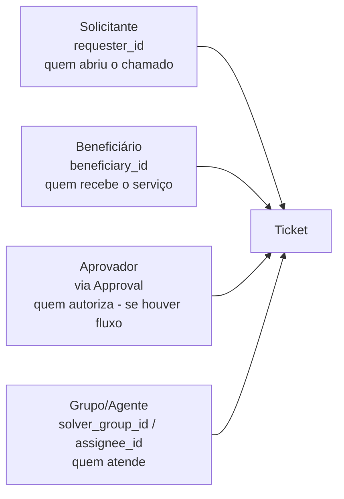
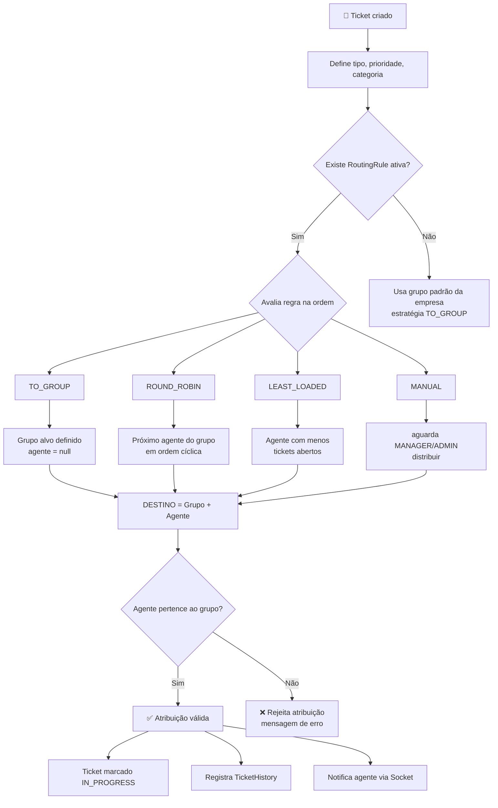
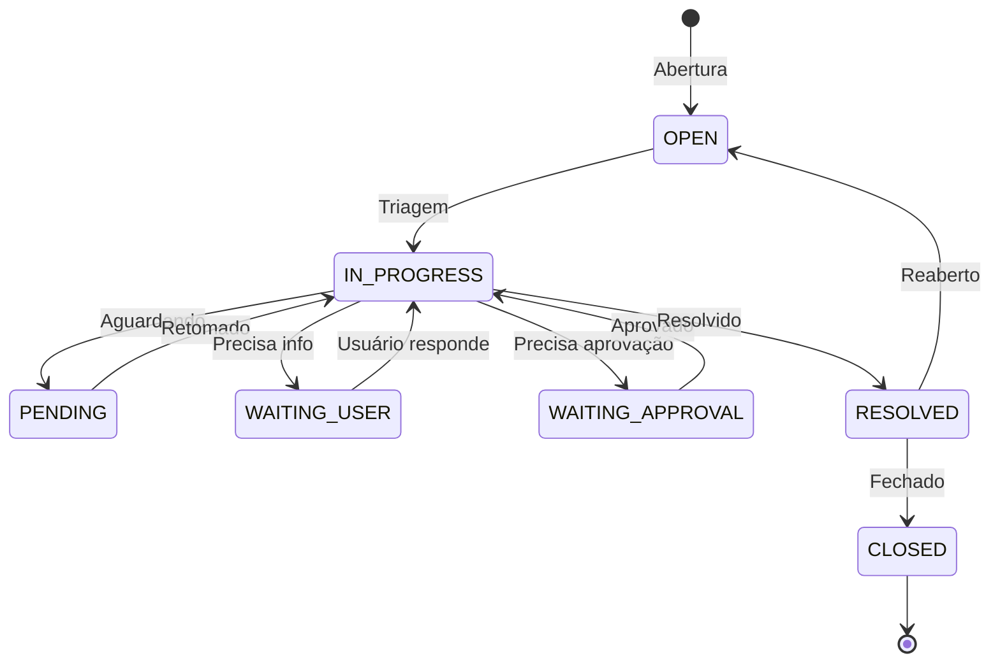
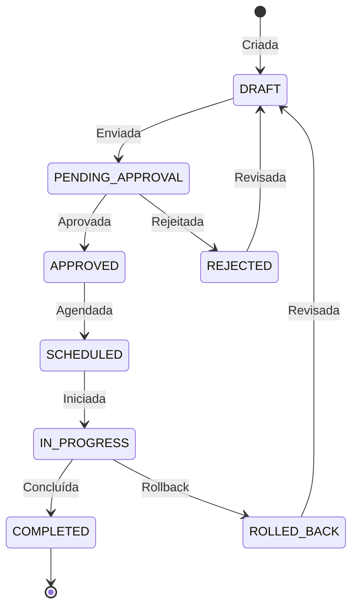

# ERD - Service Desk ITIL v4

## Visão Geral

Diagrama Entidade-Relacionamento do sistema de Service Desk baseado em ITIL v4.
O sistema suporta multi-empresas, grupos solucionadores dinâmicos e aprovações multietapas.

---

## Diagrama Relacional (Mermaid)

```mermaid
erDiagram
    %% ============================================
    %% MODELOS BASE
    %% ============================================

    User {
        uuid id PK
        string name
        string email UK
        string password
        string role "ADMIN|MANAGER|AGENT|USER"
        string status "ACTIVE|INACTIVE|PENDING"
        string locale "pt-BR|en-US|es-ES (padrao: pt-BR)"
        string avatar
        uuid companyId FK "nullable"
        uuid solverGroupId FK "nullable"
        timestamp createdAt
        timestamp updatedAt
    }

    Company {
        uuid id PK
        string name UK
        string cnpj UK "nullable"
        string status "ACTIVE|INACTIVE|PENDING"
        timestamp createdAt
        timestamp updatedAt
    }

    %% ============================================
    %% GRUPOS SOLUCIONADORES
    %% ============================================

    SolverGroup {
        uuid id PK
        string name UK
        string description
        string level "N1|N2|N3|N4|REDES|INFRA|DEVOPS|DATABASE|SECURITY"
        string status "ACTIVE|INACTIVE|PENDING"
        timestamp createdAt
        timestamp updatedAt
    }

    %% ============================================
    %% TICKETS (INCIDENTES + REQUISICOES)
    %% ============================================

    Ticket {
        uuid id PK
        string ticketNumber UK "SD-2026-000124 (amigavel, por ano)"
        uuid requesterId FK "Solicitante - quem abriu (sempre tem)"
        uuid beneficiaryId FK "nullable - Beneficiario do servico (se diferente)"
        string title
        string description
        string type "INCIDENT|SERVICE_REQUEST"
        string status "OPEN|IN_PROGRESS|PENDING|WAITING_USER|WAITING_APPROVAL|RESOLVED|CLOSED"
        string priority "LOW|MEDIUM|HIGH|CRITICAL"
        string impact "LOW|MEDIUM|HIGH|CRITICAL"
        string urgency "LOW|MEDIUM|HIGH|CRITICAL"
        datetime slaResponseAt "nullable"
        datetime slaResolveAt "nullable"
        boolean slaBreached
        uuid assigneeId FK "nullable"
        uuid companyId FK
        uuid solverGroupId FK "nullable"
        timestamp createdAt
        timestamp updatedAt
        datetime resolvedAt "nullable"
        datetime closedAt "nullable"
    }

    TicketComment {
        uuid id PK
        string content
        string visibility "PUBLIC|INTERNAL" "INTERNAL = so agentes/grupos"
        uuid ticketId FK
        uuid authorId FK
        timestamp createdAt
    }

    TicketHistory {
        uuid id PK
        string field "campo alterado"
        string oldValue "nullable"
        string newValue "nullable"
        uuid ticketId FK
        uuid userId FK
        timestamp createdAt
    }

    Attachment {
        uuid id PK
        string filename
        string url
        int size
        string mimetype
        uuid ticketId FK
        timestamp createdAt
    }

    %% ============================================
    %% PROBLEMAS
    %% ============================================

    Problem {
        uuid id PK
        string title
        string description
        string status "OPEN|IN_PROGRESS|RESOLVED|CLOSED"
        string impact "LOW|MEDIUM|HIGH|CRITICAL"
        string rootCause "nullable"
        string workaround "nullable"
        string solution "nullable"
        uuid companyId FK
        timestamp createdAt
        timestamp updatedAt
        datetime resolvedAt "nullable"
    }

    ProblemTicket {
        uuid id PK
        uuid problemId FK
        uuid ticketId FK
        timestamp createdAt
    }

    %% ============================================
    %% MUDANCAS
    %% ============================================

    Change {
        uuid id PK
        string title
        string description
        string type "STANDARD|NORMAL|EMERGENCY"
        string status "DRAFT|PENDING_APPROVAL|APPROVED|REJECTED|SCHEDULED|IN_PROGRESS|COMPLETED|ROLLED_BACK"
        string risk "LOW|MEDIUM|HIGH"
        string reason
        string plan "plano de implementacao"
        string rollbackPlan "plano de rollback"
        datetime scheduledAt "nullable"
        uuid companyId FK
        uuid requesterId FK "quem solicitou a mudanca"
        timestamp createdAt
        timestamp updatedAt
    }

    ChangeTicket {
        uuid id PK
        uuid changeId FK
        uuid ticketId FK
        timestamp createdAt
    }

    %% ============================================
    %% APROVACOES MULTIETAPAS
    %% ============================================

    Approval {
        uuid id PK
        string status "PENDING|APPROVED|REJECTED"
        string comment "nullable"
        int order "ordem da aprovacao no fluxo"
        uuid ticketId FK "nullable"
        uuid changeId FK "nullable"
        uuid approverId FK
        timestamp createdAt
        timestamp updatedAt
    }

    ApprovalFlow {
        uuid id PK
        string name
        string description
        string entityType "TICKET|CHANGE"
        json rules "regras de aprovacao"
        string status "ACTIVE|INACTIVE"
        uuid companyId FK
        timestamp createdAt
        timestamp updatedAt
    }

    %% ============================================
    %% ROTEAMENTO E AUTO-ATRIBUICAO
    %% ============================================

    RoutingRule {
        uuid id PK
        string name
        string description "nullable"
        string ticketType "INCIDENT|SERVICE_REQUEST"
        string priority "nullable"
        string category "nullable"
        string strategy "TO_GROUP|ROUND_ROBIN|LEAST_LOADED|MANUAL"
        string targetGroupId FK "nullable"
        int order "ordem de avaliacao da regra"
        string status "ACTIVE|INACTIVE"
        uuid companyId FK "nullable"
        timestamp createdAt
        timestamp updatedAt
    }

    %% ============================================
    %% SEQUENCIA DE NUMERACAO (Ticket Number)
    %% ============================================

    SequenceCounter {
        uuid id PK
        string entityType "TICKET|CHANGE|PROBLEM"
        int year "ano da sequencia"
        uuid companyId FK "nullable (futuro multi-empresa)"
        int lastValue "ultimo numero usado"
        timestamp createdAt
        timestamp updatedAt

        @@unique([entityType, year, companyId])
    }

    %% ============================================
    %% SLA
    %% ============================================

    SLAPolicy {
        uuid id PK
        string name
        string description "nullable"
        string type "INCIDENT|SERVICE_REQUEST"
        string priority "LOW|MEDIUM|HIGH|CRITICAL"
        int responseTime "tempo em minutos"
        int resolveTime "tempo em minutos"
        string status "ACTIVE|INACTIVE"
        timestamp createdAt
        timestamp updatedAt
    }

    %% ============================================
    %% BASE DE CONHECIMENTO
    %% ============================================

    KnowledgeArticle {
        uuid id PK
        string title
        string content
        string category
        json tags "array de strings"
        boolean published
        uuid authorId FK
        timestamp createdAt
        timestamp updatedAt
    }

    %% ============================================
    %% AUDITORIA
    %% ============================================

    AuditLog {
        uuid id PK
        string action "CREATE|UPDATE|DELETE|LOGIN|..."
        string entity "User|Ticket|Change|..."
        uuid entityId "nullable"
        json oldData "nullable"
        json newData "nullable"
        uuid userId "nullable"
        string ip "nullable"
        string userAgent "nullable"
        timestamp createdAt
    }

    %% ============================================
    %% RELACIONAMENTOS
    %% ============================================

    Company ||--o{ User : "possui"
    Company ||--o{ Ticket : "possui"
    Company ||--o{ Problem : "possui"
    Company ||--o{ Change : "possui"
    Company ||--o{ ApprovalFlow : "possui"

    SolverGroup ||--o{ User : "possui"
    SolverGroup ||--o{ Ticket : "recebe"
    SolverGroup ||--o{ RoutingRule : "alvo de roteamento"

    User ||--o{ Ticket : "solicitante (requester)"
    User ||--o{ Ticket : "beneficiario (beneficiary)"
    User ||--o{ Ticket : "atribuido"
    User ||--o{ TicketComment : "comenta"
    User ||--o{ TicketHistory : "registra"
    User ||--o{ Approval : "aprova"
    User ||--o{ KnowledgeArticle : "escreve"
    User ||--o{ AuditLog : "gera"
    User ||--o{ Change : "solicita (requester)"

    Company ||--o{ RoutingRule : "configura"

    Ticket ||--o{ TicketComment : "possui"
    Ticket ||--o{ TicketHistory : "possui"
    Ticket ||--o{ Attachment : "possui"
    Ticket ||--o{ Approval : "precisa"
    Ticket ||--o{ RoutingRule : "roteado por"
    Ticket }o--o{ Problem : "relacionado"
    Ticket }o--o{ Change : "relacionado"

    Approval }o--o| ApprovalFlow : "segue"
```

---

## Descrição dos Relacionamentos

### 1. Usuários e Empresas

| Relation       | Tipo | Descrição                          |
| -------------- | ---- | ---------------------------------- |
| Company → User | 1:N  | Uma empresa possui vários usuários |
| User → Company | N:1  | Um usuário pertence a uma empresa  |

### 1.1 Internacionalização (i18n)

O sistema é internacionalizado desde a primeira versão:

| Idioma             | Locale  | Uso                   |
| ------------------ | ------- | --------------------- |
| Português (Brasil) | `pt-BR` | **Padrão** (fallback) |
| Inglês (EUA)       | `en-US` | Suporte               |
| Espanhol           | `es-ES` | Suporte               |

- O campo `User.locale` guarda a preferência de idioma do usuário (interface + e-mails)
- Detecção de idioma: `Accept-Language` header → `?lang=` → `User.locale` → fallback `pt-BR`
- Mensagens de erro/business da API são traduzidas e retornam `key/args` (ver API.md)
- `TicketComment` etc. não têm campo de idioma — o conteúdo é do autor; apenas
  metadados/comentários do sistema e mensagens de erro são localizados

### 2. Usuários e Grupos Solucionadores

| Relação            | Tipo | Descrição                                                         |
| ------------------ | ---- | ----------------------------------------------------------------- |
| SolverGroup → User | 1:N  | Um grupo possui **1 ou mais** agentes (mínimo 1 obrigatório)      |
| User → SolverGroup | N:1  | Um agente pertence a **exatamente 1** grupo (null = não é agente) |

> **Regra de negócio:** Um grupo solucionador só existe se tiver no mínimo **1 usuário AGENT** vinculado. O vínculo é feito via `solver_group_id` no usuário. Todos os agentes do grupo herdam as capacidades do nível dele (N1, N2, DEVOPS...).

### 2.1 Direcionamento e Atribuição de Tickets

| Regra               | Descrição                                                                                                   |
| ------------------- | ----------------------------------------------------------------------------------------------------------- |
| **Direcionamento**  | Todo ticket criado é direcionado a um **destino**: um `solverGroupId` (grupo) e/ou um `assigneeId` (agente) |
| **Destino mínimo**  | O ticket **obrigatoriamente** tem pelo menos 1 destino (grupo OU agente)                                    |
| **Coerência**       | Se ambos forem definidos, o agente **deve pertencer** ao grupo informado                                    |
| **Grupo**           | Direciona o ticket ao grupo como um todo; qualquer agente do grupo pode atendê-lo                           |
| **Agente**          | Atribui diretamente a um agente específico; mesmo assim pode manter o grupo de origem                       |
| **Auto-atribuição** | Regras de `RoutingRule` definem o destino automático conforme tipo/prioridade/categoria                     |

**Estratégias de auto-atribuição (RoutingRule.strategy):**

| Estratégia     | Comportamento                                               |
| -------------- | ----------------------------------------------------------- |
| `TO_GROUP`     | Direciona para um grupo fixo (ex: todo INCIDENT → N1)       |
| `ROUND_ROBIN`  | Atribui ao próximo agente do grupo em ordem cíclica         |
| `LEAST_LOADED` | Atribui ao agente do grupo com menos tickets abertos        |
| `MANUAL`       | Sem auto-atribuição; um MANAGER/ADMIN distribui manualmente |

### 3. Tickets

| Relação                     | Tipo | Descrição                                                               |
| --------------------------- | ---- | ----------------------------------------------------------------------- |
| User → Ticket (requester)   | 1:N  | Um usuário é **solicitante** de vários tickets (quem abre o chamado)    |
| User → Ticket (beneficiary) | 1:N  | Um usuário é **beneficiário** de vários tickets (quem recebe o serviço) |
| User → Ticket (assignee)    | 1:N  | Um agente recebe vários tickets                                         |
| Company → Ticket            | 1:N  | Uma empresa possui vários tickets                                       |
| SolverGroup → Ticket        | 1:N  | Um grupo recebe vários tickets                                          |
| User → TicketComment        | 1:N  | Um usuário escreve vários comentários                                   |
| Ticket → TicketComment      | 1:N  | Um ticket possui vários comentários (PUBLIC + INTERNAL)                 |
| Ticket → TicketHistory      | 1:N  | Um ticket possui várias alterações no histórico                         |
| Ticket → Attachment         | 1:N  | Um ticket possui vários anexos                                          |
| Ticket → Approval           | 1:N  | Um ticket pode precisar de várias aprovações                            |

### 3.1 Solicitante, Beneficiário e Aprovador

Todo ticket possui **personas bem definidas**:



| Persona          | Campo                          | Obrigatório              | Papel                                                                 |
| ---------------- | ------------------------------ | ------------------------ | --------------------------------------------------------------------- |
| **Solicitante**  | `ticket.requesterId`           | **Sempre**               | Usuário que registrou a solicitação (pode ser o próprio beneficiário) |
| **Beneficiário** | `ticket.beneficiaryId`         | Opcional                 | Usuário que usufrui do resultado; se vazio, assume o solicitante      |
| **Aprovador**    | `Approval.approverId`          | Quando houver fluxo      | Usuário com poder de autorizar (gerencial, comercial, técnico)        |
| **Atendente**    | `assigneeId` / `solverGroupId` | Pela regra de atribuição | Grupo e/ou agente responsável por resolver                            |

**Casos comuns:**

| Caso                                  | Solicitante        | Beneficiário                           |
| ------------------------------------- | ------------------ | -------------------------------------- |
| Usuário reporta erro no sistema       | O próprio usuário  | O mesmo usuário (igual ao solicitante) |
| Gestor pede notebook para funcionário | Gestor             | Funcionário (diferente)                |
| Time de redes abre chamado de infra   | Agente de redes    | A empresa/usuário afetado              |
| Aprovação de mudança                  | Criador da mudança | — (aprovador via ApprovalFlow)         |

> **Regra:** Se `beneficiaryId` não for informado na criação, o sistema copia `requesterId`.

### 3.2 Visibilidade de Comentários Internos

```
┌──────────────────────┐   ┌──────────────────────┐
│  Comentário PUBLIC    │   │  Comentário INTERNAL  │
│  (público)           │   │  (só equipe técnica)  │
├──────────────────────┤   ├──────────────────────┤
│ ✔ Solicitante        │   │ ✘ Solicitante         │
│ ✔ Beneficiário       │   │ ✘ Beneficiário        │
│ ✔ Grupo/Agente       │   │ ✔ Grupo/Agente        │
│ ✔ Aprovadores        │   │ ✘ Aprovadores         │
│ ✔ Admin/Manager      │   │ ✔ Admin/Manager       │
└──────────────────────┘   └──────────────────────┘
```

- `visibility = INTERNAL`: destinado **exclusivamente** à equipe de atendimento
  (agentes, grupos solucionadores, gestores técnicos)
  - Finalidade técnica: diagnósticos, hipóteses, links de infra — **irrelevante/desnecessário ao cliente**
- `visibility = PUBLIC`: o que o cliente (solicitante/beneficiário) e aprovadores devem ver
- **Solicitante, Beneficiário e Aprovadores NUNCA veem comentários INTERNAL**, mesmo que
  estejam em roles superiores acidentalmente configuradas; a regra vale por participação no ticket
  (lado cliente vs lado atendimento)

### 3.3 Numeração de Tickets (Número Amigável)

Todo ticket recebe um **número de exibição amigável e único**, legível por humanos
(para badges, e-mails, busca e referência no suporte). O `id` UUID permanece como
chave interna do sistema.

**Formato:**

```
SD-2026-000124
└┬┘ └┬┘  └──┬──┘
 │   │      └─ Sequência por ano (zerofilled, 6 dígitos)
 │   └──────── Ano da abertura (4 dígitos)
 └──────────── Prefixo fixo da plataforma (Service Desk)
```

**Exemplos:**

- `SD-2026-000001` — primeiro ticket do ano
- `SD-2026-000124` — 124º ticket de 2026
- `SD-2027-000001` — primeiro ticket do ano seguinte (reinicia por ano)

**Regras de sequência:**

| Regra                | Descrição                                                                        |
| -------------------- | -------------------------------------------------------------------------------- |
| Unicidade            | `ticketNumber` é `UNIQUE` — sem duplicados                                       |
| Escopo               | Sequência por **ano** (reinicia em 01/01)                                        |
| Faturamento          | Definida por `SequenceCounter` (atomic `UPDATE ... RETURNING`)                   |
| Atomicidade          | Incremento e criação do ticket na **mesma transação** (sem buracos concorrentes) |
| Entidades            | Reutilizável para `CHANGE` e `PROBLEM` (prefixos `SDC-`, `SDP-`)                 |
| Futuro multi-empresa | Sequência por `companyId` opcional (ex: `SD-2026-ACME-000124`)                   |

**Mecanismo (transação atômica):**

1. `BEGIN`
2. `UPDATE sequence_counters SET last_value = last_value + 1 WHERE ... RETURNING last_value` (com row lock)
3. Monta `ticketNumber = SD-{year}-{last_value zerofill 6}`
4. `INSERT` do ticket com `ticketNumber`
5. `COMMIT`

### 4. Problemas

| Relação          | Tipo | Descrição                                                               |
| ---------------- | ---- | ----------------------------------------------------------------------- |
| Problem → Ticket | M:N  | Um problema pode estar relacionado a vários tickets (via ProblemTicket) |

### 5. Mudanças

| Relação           | Tipo | Descrição                                                              |
| ----------------- | ---- | ---------------------------------------------------------------------- |
| Change → Ticket   | M:N  | Uma mudança pode estar relacionada a vários tickets (via ChangeTicket) |
| Change → Approval | 1:N  | Uma mudança pode precisar de várias aprovações                         |

### 6. Aprovações

| Relação                  | Tipo | Descrição                                |
| ------------------------ | ---- | ---------------------------------------- |
| ApprovalFlow → Approval  | 1:N  | Um fluxo define várias aprovações        |
| Ticket/Change → Approval | 1:N  | Tickets e Changes precisam de aprovações |

### 7. Roteamento (Auto-atribuição)

| Relação                   | Tipo | Descrição                                                 |
| ------------------------- | ---- | --------------------------------------------------------- |
| RoutingRule → SolverGroup | N:1  | Uma regra aponta para um grupo alvo (estratégia TO_GROUP) |
| RoutingRule → Ticket      | 1:N  | Uma regra roteia vários tickets                           |
| Company → RoutingRule     | 1:N  | Cada empresa pode ter suas próprias regras                |
| Ticket → RoutingRule      | N:1  | O ticket registra qual regra o roteou                     |

---

## Tabelas de Domínio (Enums)

### Roles (Dinâmicas)

> **NOTA:** As roles são definidas dinamicamente no banco.
> A role base do sistema é: ADMIN, MANAGER, AGENT, USER
> Papéis adicionais podem ser criados via configuração.

```sql
CREATE TYPE user_role AS ENUM ('ADMIN', 'MANAGER', 'AGENT', 'USER');
CREATE TYPE user_status AS ENUM ('ACTIVE', 'INACTIVE', 'PENDING');
```

### Grupos Solucionadores

```sql
CREATE TYPE group_level AS ENUM (
    'N1', 'N2', 'N3', 'N4',
    'REDES', 'INFRA', 'DEVOPS', 'DATABASE', 'SECURITY'
);
```

### Tickets

```sql
CREATE TYPE ticket_type AS ENUM ('INCIDENT', 'SERVICE_REQUEST');
CREATE TYPE ticket_status AS ENUM (
    'OPEN', 'IN_PROGRESS', 'PENDING',
    'WAITING_USER', 'WAITING_APPROVAL',
    'RESOLVED', 'CLOSED'
);
CREATE TYPE priority_level AS ENUM ('LOW', 'MEDIUM', 'HIGH', 'CRITICAL');
CREATE TYPE impact_level AS ENUM ('LOW', 'MEDIUM', 'HIGH', 'CRITICAL');
CREATE TYPE urgency_level AS ENUM ('LOW', 'MEDIUM', 'HIGH', 'CRITICAL');
CREATE TYPE comment_visibility AS ENUM (
    'PUBLIC',    -- visível ao solicitante, beneficiário, agentes e aprovadores
    'INTERNAL'   -- visível apenas a agentes/matriz (solicitante e beneficiário NUNCA veem)
);
```

### Problemas

```sql
CREATE TYPE problem_status AS ENUM ('OPEN', 'IN_PROGRESS', 'RESOLVED', 'CLOSED');
```

### Mudanças

```sql
CREATE TYPE change_type AS ENUM ('STANDARD', 'NORMAL', 'EMERGENCY');
CREATE TYPE change_status AS ENUM (
    'DRAFT', 'PENDING_APPROVAL', 'APPROVED', 'REJECTED',
    'SCHEDULED', 'IN_PROGRESS', 'COMPLETED', 'ROLLED_BACK'
);
CREATE TYPE risk_level AS ENUM ('LOW', 'MEDIUM', 'HIGH');
```

### Aprovações

```sql
CREATE TYPE approval_status AS ENUM ('PENDING', 'APPROVED', 'REJECTED');
```

### Roteamento e Atribuição

```sql
CREATE TYPE routing_strategy AS ENUM (
    'TO_GROUP',       -- Direciona para um grupo fixo
    'ROUND_ROBIN',    -- Próximo agente do grupo em ordem cíclica
    'LEAST_LOADED',   -- Agente com menos tickets abertos
    'MANUAL'          -- Distribuição manual (MANAGER/ADMIN)
);
```

---

## Índices Recomendados

```sql
-- Performance para consultas frequentes
CREATE INDEX idx_users_email ON users(email);
CREATE INDEX idx_users_company ON users(company_id);
CREATE INDEX idx_users_solver_group ON users(solver_group_id);

CREATE INDEX idx_tickets_status ON tickets(status);
CREATE INDEX idx_tickets_type ON tickets(type);
CREATE INDEX idx_tickets_priority ON tickets(priority);
CREATE INDEX idx_tickets_requester ON tickets(requester_id);
CREATE INDEX idx_tickets_beneficiary ON tickets(beneficiary_id);
CREATE INDEX idx_tickets_assignee ON tickets(assignee_id);
CREATE INDEX idx_tickets_company ON tickets(company_id);
CREATE INDEX idx_tickets_solver_group ON tickets(solver_group_id);
CREATE INDEX idx_tickets_created ON tickets(created_at DESC);
CREATE UNIQUE INDEX idx_tickets_number ON tickets(ticket_number);
CREATE INDEX idx_sequences_entity ON sequence_counters(entity_type, year, company_id);

CREATE INDEX idx_ticket_comments_ticket ON ticket_comments(ticket_id);
CREATE INDEX idx_ticket_comments_visibility ON ticket_comments(ticket_id, visibility);
CREATE INDEX idx_ticket_history_ticket ON ticket_history(ticket_id);

CREATE INDEX idx_approvals_status ON approvals(status);
CREATE INDEX idx_approvals_ticket ON approvals(ticket_id);
CREATE INDEX idx_approvals_change ON approvals(change_id);
CREATE INDEX idx_approvals_approver ON approvals(approver_id);

CREATE INDEX idx_routing_rules_company ON routing_rules(company_id);
CREATE INDEX idx_routing_rules_type ON routing_rules(ticket_type, priority);
CREATE INDEX idx_routing_rules_group ON routing_rules(target_group_id);
CREATE INDEX idx_routing_rules_status ON routing_rules(status, order);

CREATE INDEX idx_audit_logs_user ON audit_logs(user_id);
CREATE INDEX idx_audit_logs_entity ON audit_logs(entity, entity_id);
CREATE INDEX idx_audit_logs_created ON audit_logs(created_at DESC);

CREATE INDEX idx_knowledge_category ON knowledge_articles(category);
CREATE INDEX idx_knowledge_published ON knowledge_articles(published);
```

---

## Fluxo de Dados

```
┌─────────────────────────────────────────────────────────────────┐
│                         FLUXO PRINCIPAL                         │
├─────────────────────────────────────────────────────────────────┤
│                                                                 │
│  [Usuário] ────► [Ticket] ────► [SolverGroup] ────► [Resposta] │
│       │              │                │                │        │
│       ▼              ▼                ▼                ▼        │
│   Cria ticket   Classifica      Atribui para     Solucao ou   │
│   (User)        (Sistema)       agente (N1/N2)   Escalacao    │
│                                                                 │
├─────────────────────────────────────────────────────────────────┤
│                  FLUXO ATRIBUIÇÃO E DIRECIONAMENTO              │
├─────────────────────────────────────────────────────────────────┤
│                                                                 │
│  [RoutingRule] ────► [DESTINO]                                 │
│       │                │  TO_GROUP     → grupo fixo            │
│       │                │  ROUND_ROBIN  → próximo agente        │
│       ▼                │  LEAST_LOADED → agente menos ocupado  │
│   Avalia por          │  MANUAL       → MANAGER/ADMIN decide  │
│   tipo+prioridade     │                                        │
│   +categoria          ▼                                        │
│                        [Grupo + Agente]                        │
│                        (agente deve pertencer ao grupo)        │
│                                                                 │
├─────────────────────────────────────────────────────────────────┤
│                         FLUXO SLA                               │
├─────────────────────────────────────────────────────────────────┤
│                                                                 │
│  [SLAPolicy] ────► [Ticket.slaResponseAt]                      │
│       │              │                                          │
│       ▼              ▼                                          │
│   Define tempos   Calcula automaticamente                      │
│                   baseado na prioridade                        │
│                                                                 │
├─────────────────────────────────────────────────────────────────┤
│                       FLUXO APROVAÇÃO                           │
├─────────────────────────────────────────────────────────────────┤
│                                                                 │
│  [Ticket/Change] ────► [ApprovalFlow] ────► [Approval]         │
│       │                    │                    │               │
│       ▼                    ▼                    ▼               │
│   Solicita           Define regras       Aprovador decide      │
│   aprovacao          de aprovacao        (1ª, 2ª via)          │
│                                                                 │
└─────────────────────────────────────────────────────────────────┘
```

---

## Diagrama de Decisão de Atribuição



---

## Diagrama de Estados - Ticket



---

## Diagrama de Estados - Mudança



---

## Próximos Passos

1. Criar o schema Prisma baseado neste ERD
2. Configurar migrations
3. Criar seed data para testes
4. Implementar módulos na ordem definida no TODO
