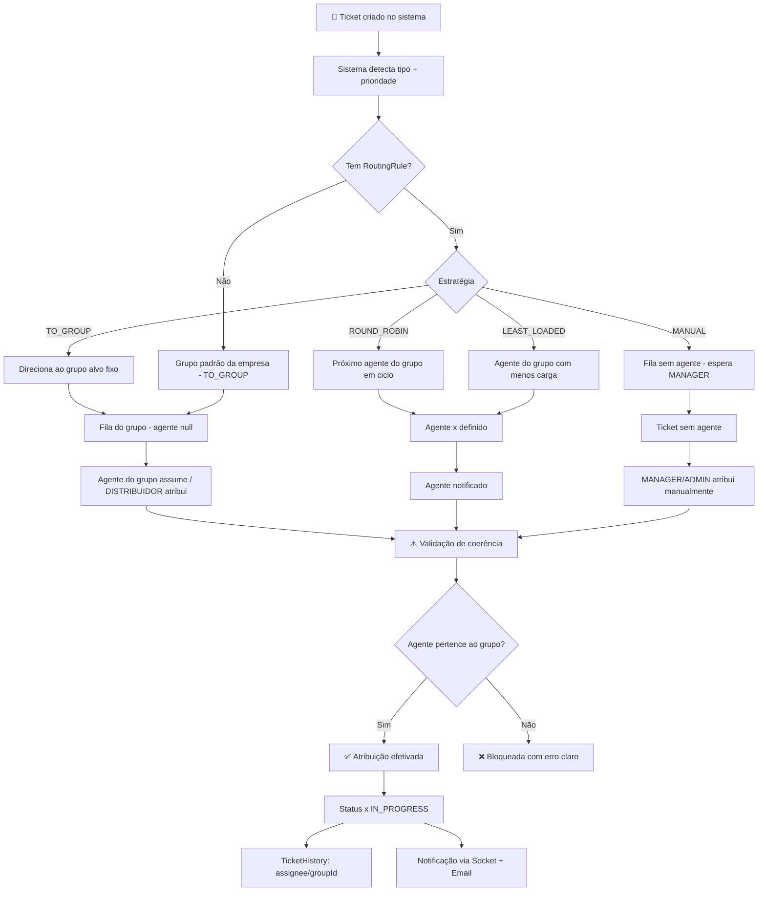
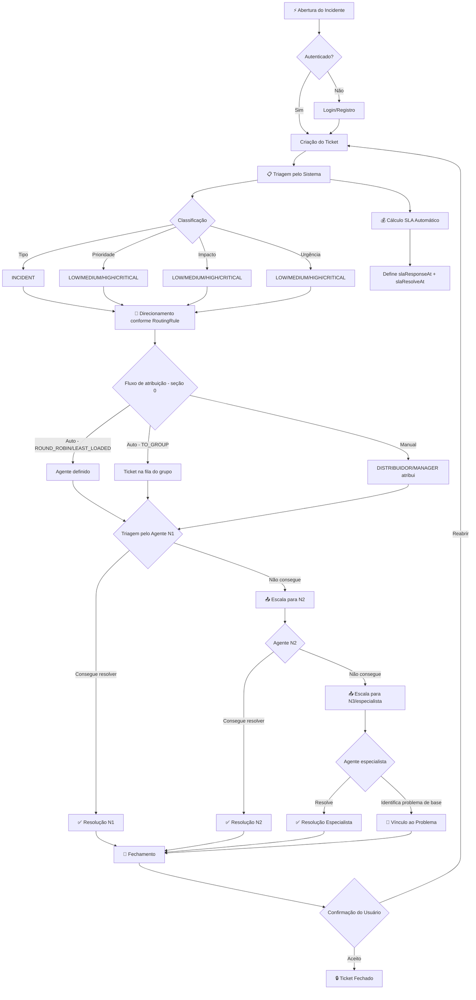
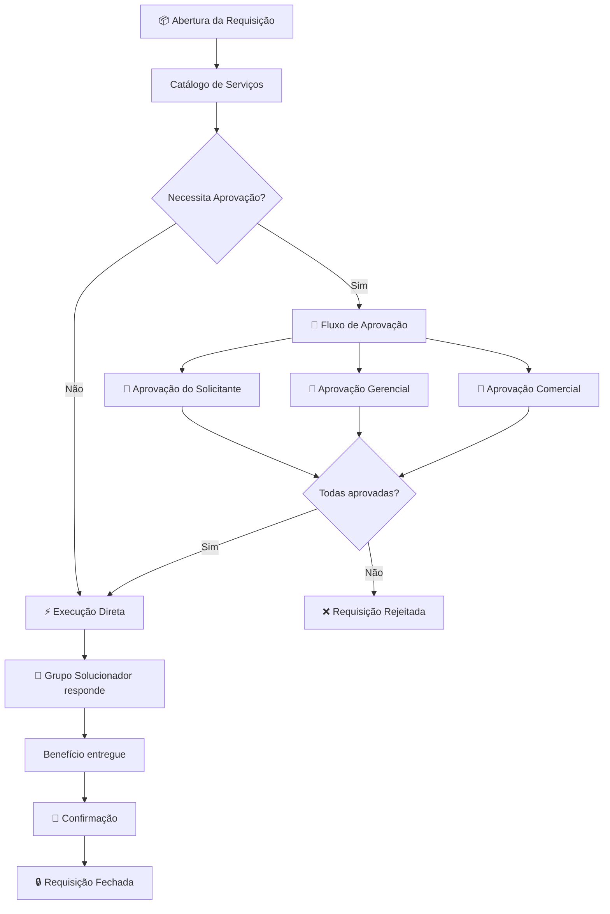
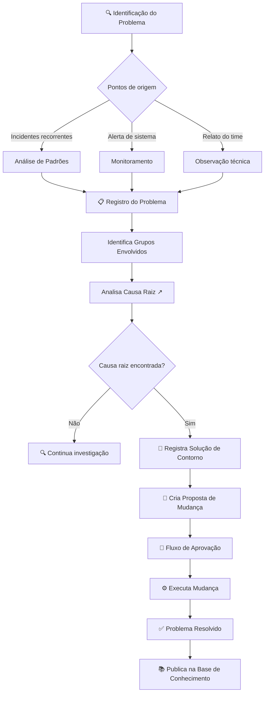
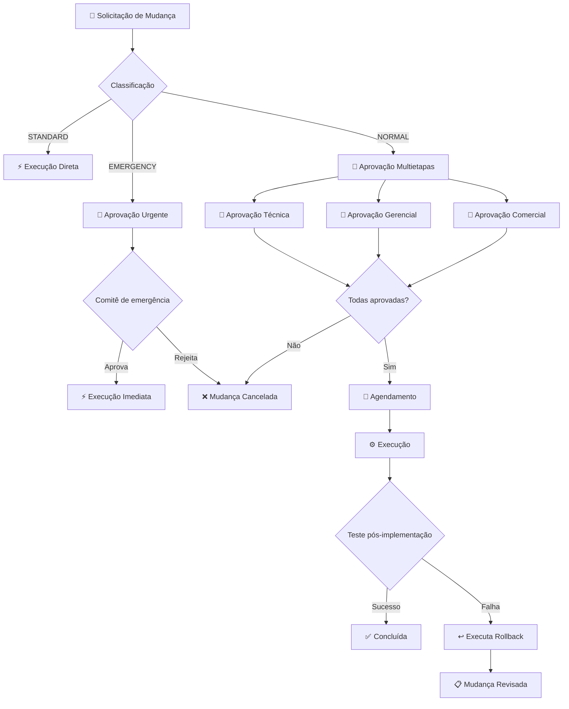
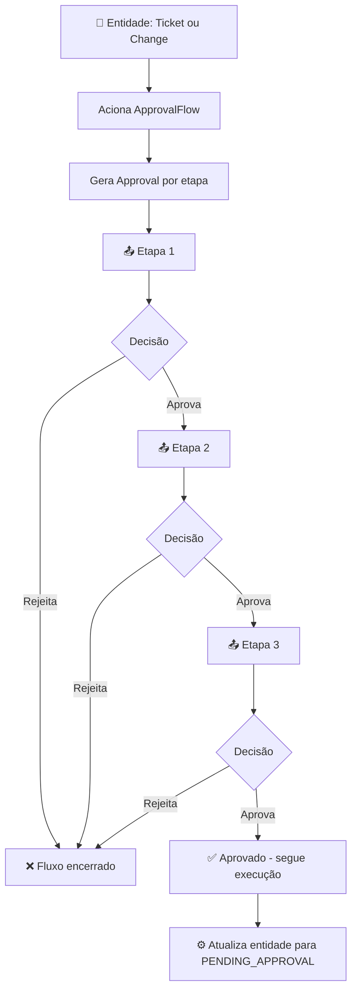
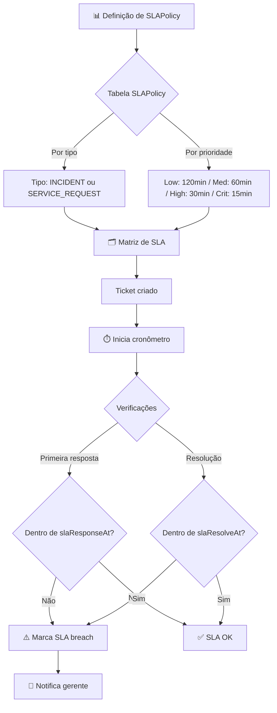
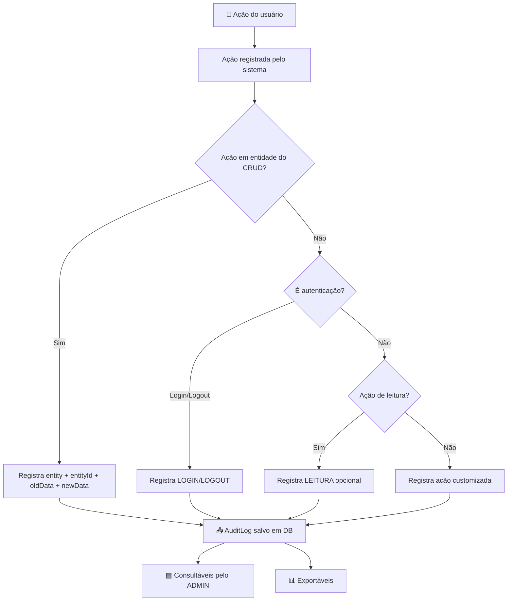
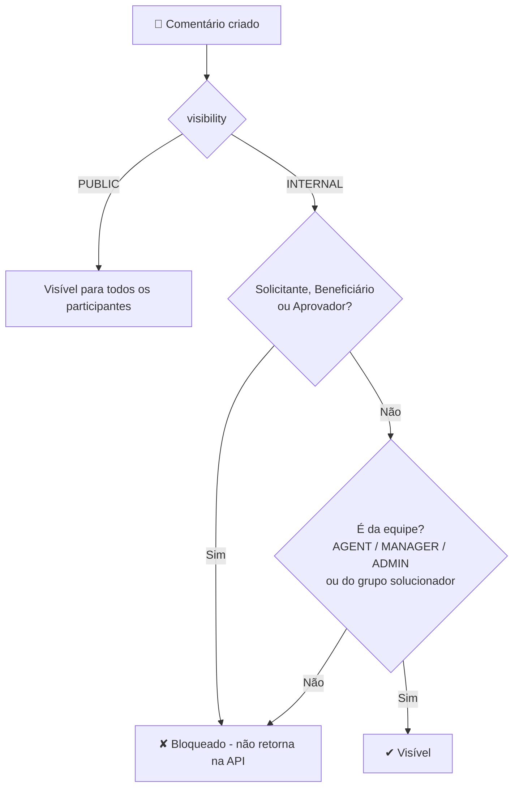

# Fluxos de Atendimento - Service Desk ITIL v4

## Visão Geral

Documentação dos processos de atendimento seguindo as práticas do ITIL v4.
Cada fluxo define as etapas, responsáveis e transições de estado do sistema.

---

## 0. Fluxo de Atribuição e Direcionamento

### Conceito

Todo ticket possui um **destino de atendimento**. O destinos pode ser:

| Destino                | Campo no Ticket                | Comportamento                                                         |
| ---------------------- | ------------------------------ | --------------------------------------------------------------------- |
| **Grupo Solucionador** | `solverGroupId`                | O ticket fica na fila do grupo; qualquer agente do grupo pode assumir |
| **Agente específico**  | `assigneeId`                   | Vai direto para um agente; só ele atende                              |
| **Grupo + Agente**     | `solverGroupId` + `assigneeId` | Agente recebe e o grupo permanece como contexto/instrumento           |

> **Regra:** Um grupo solucionador é um conjunto de **usuários AGENT** (mínimo 1, sem limite máximo).
> Um agente pertence a exatamente 1 grupo. Direcionar para agente exige que ele seja AGENT e,
> se houver grupo no destino, que pertença a esse grupo.

### Fluxograma do Direcionamento



### Regras de Atribuição (Segurança e Coerência)

| #   | Regra                                                                           | Validação no sistema                         |
| --- | ------------------------------------------------------------------------------- | -------------------------------------------- |
| 1   | Grupo solucionador exige **mín. 1 agente**                                      | Não permite criar grupo sem agente vinculado |
| 2   | Agente pertence a **1 grupo** apenas                                            | `solver_group_id` único por usuário          |
| 3   | Destino do ticket possui **pelo menos** grupo OU agente                         | Rejeita ticket sem destino                   |
| 4   | Se houver agente + grupo, agente **deve** ser do grupo                          | Rejeita com erro 422                         |
| 5   | Atribuição manual para agente exige role **MANAGER/ADMIN**                      | Guard no endpoint                            |
| 6   | Pickup (agente assume ticket da fila) exige role **AGENT** e pertencer ao grupo | Guard no endpoint                            |
| 7   | Apenas grupos **ACTIVE** recebem tickets                                        | Rejeita grupo inativo                        |
| 8   | Agente **ACTIVE** para receber auto-atribuição                                  | ROUND_ROBIN/LEAST_LOADED ignora inativos     |
| 9   | Escala de nível: Nx → N(x+1) ou especialista                                    | Valida nível do grupo destino                |
| 10  | Toda atribuição registra **TicketHistory** + **AuditLog**                       | Rastreabilidade completa                     |

### Auto-atribuição - Regra de Exemplo (RoutingRule)

```json
{
  "name": "Incidentes Críticos → N2",
  "ticketType": "INCIDENT",
  "priority": "CRITICAL",
  "strategy": "TO_GROUP",
  "targetGroup": "N2",
  "order": 1,
  "status": "ACTIVE"
}
```

```json
{
  "name": "Requisições de acesso → Round-robin em N1",
  "ticketType": "SERVICE_REQUEST",
  "strategy": "ROUND_ROBIN",
  "targetGroup": "N1",
  "order": 2
}
```

### Atribuição Manual (MANUAL)

```json
POST /api/tickets/:id/assign
{
  "assigneeId": "uuid-do-agente",
  "solverGroupId": "uuid-do-grupo" // opcional
}
```

**Comportamento do sistema:**

1. Valida `assigneeId` é um usuário AGENT + `ACTIVE`
2. Valida `solverGroupId` é um grupo `ACTIVE`
3. Se ambos: valida agente ∈ grupo (senão → 422)
4. Persiste `IN_PROGRESS` + notifica

---

## 1. Fluxo de Incidente



### Etapas Detalhadas

| #   | Etapa         | Responsável      | Ação                                             | Estado Resultante |
| --- | ------------- | ---------------- | ------------------------------------------------ | ----------------- |
| 1   | Abertura      | Usuário          | Cria ticket informando título e descrição        | `OPEN`            |
| 2   | Triagem       | Sistema          | Identifica tipo: Incident ou Service Request     | —                 |
| 3   | Classificação | Sistema + Agente | Determina prioridade, impacto e urgência         | —                 |
| 4   | SLA           | Sistema          | Calcula `slaResponseAt` e `slaResolveAt`         | —                 |
| 5   | Atribuição    | Sistema          | Associa ao grupo solucionador (N1 por padrão)    | `IN_PROGRESS`     |
| 6   | Diagnóstico   | Agente           | Verifica se consegue resolver ou precisa escalar | —                 |
| 7   | Escala        | Agente           | Transfere para grupo nível superior              | `IN_PROGRESS`     |
| 8   | Resolução     | Agente           | Aplica solução e registra em `resolvedAt`        | `RESOLVED`        |
| 9   | Fechamento    | Agente/Usuário   | Confirma solução, encerra ticket                 | `CLOSED`          |

### Escala de Grupos Solucionadores

```
                ┌─────────────┐
                │    GRUPO     │
                │  SOLUCIONADOR │
                └─────────────┘
                       │
       ┌───────────────┼───────────────┐
       │               │               │
       ▼               ▼               ▼
┌───────────┐  ┌──────────────┐  ┌──────────────┐
│    N1     │  │     N2       │  │     N3       │
│ Atendente │→ │ Especialista │→ │  Especialista│
│  general  │  │   domínio    │  │  avançado    │
└───────────┘  └──────────────┘  └──────────────┘
       │               │               │
       └───────┬───────┘               │
               │                       │
       ┌───────▼───────┐       ┌───────▼───────┐
       │    DEVOPS     │       │    INFRA      │
       │  CI/CD, SRE   │       │ Servidores,   │
       │               │       │ Redes, Seg.   │
       └───────────────┘       └───────────────┘
```

---

## 2. Fluxo de Requisição de Serviço



### Exemplos de Requisição

| Requisição             | Tipo de Aprovação     | Grupo Solucionador |
| ---------------------- | --------------------- | ------------------ |
| Criação de usuário     | Gerencial             | N1                 |
| Acesso a sistema       | Comercial + Gerencial | REDES              |
| Instalação de software | Comercial             | INFRA              |
| Liberação de porta     | Segurança             | SECURITY           |
| Deploy em produção     | Comercial             | DEVOPS             |

---

## 3. Fluxo de Problema



---

## 4. Fluxo de Mudança



---

## 5. Fluxo de Aprovação Multietapas



### Regras do Fluxo de Aprovação

| Regra                  | Descrição                                                                     |
| ---------------------- | ----------------------------------------------------------------------------- |
| **Ordem**              | Cada etapa tem `order` (1, 2, 3...)                                           |
| **Condição**           | Uma etapa só inicia após a anterior ser aprovada                              |
| **Rejeição**           | Rejeição em qualquer etapa encerra o fluxo                                    |
| **Limite**             | Número de etapas configurável por `ApprovalFlow`                              |
| **Aprovador dinâmico** | Aprovador definido por: cargo, grupo solucionador, ou diretamente por usuário |

### Modelo de Dados do Fluxo de Aprovação

```json
{
  "approvalFlow": {
    "name": "Mudança em produção",
    "entityType": "CHANGE",
    "rules": {
      "stages": [
        {
          "order": 1,
          "approverRole": "MANAGER",
          "approverCategory": "TECHNICAL"
        },
        {
          "order": 2,
          "approverRole": "DIRECTOR",
          "approverCategory": "BUSINESS"
        }
      ]
    }
  }
}
```

---

## 6. Fluxo de SLA



### Matriz de SLA Recomendada

| Tipo            | Prioridade | Response Time | Resolve Time |
| --------------- | ---------- | ------------- | ------------ |
| Incident        | CRITICAL   | 15 min        | 4 horas      |
| Incident        | HIGH       | 30 min        | 8 horas      |
| Incident        | MEDIUM     | 1 hora        | 24 horas     |
| Incident        | LOW        | 2 horas       | 48 horas     |
| Service Request | CRITICAL   | 1 hora        | 8 horas      |
| Service Request | HIGH       | 2 horas       | 24 horas     |
| Service Request | MEDIUM     | 4 horas       | 72 horas     |
| Service Request | LOW        | 8 horas       | 5 dias       |

### Cálculo de Prioridade

```
Prioridade = f(Impacto, Urgência)

| Impacto \ Urgência | LOW | MEDIUM | HIGH | CRITICAL |
|--------------------|-----|--------|------|----------|
| LOW                | LOW | LOW    | MED  | MED      |
| MEDIUM             | LOW | MED    | MED  | HIGH     |
| HIGH               | MED | MED    | HIGH | HIGH     |
| CRITICAL           | MED | HIGH   | HIGH | CRITICAL |
```

---

## 7. Fluxo de Auditoria



---

## Regras de Negócio Resumidas

| Regra                  | Descrição                                                                                            |
| ---------------------- | ---------------------------------------------------------------------------------------------------- |
| Ticket sem empresa     | Não pode ser criado                                                                                  |
| Ticket sem solicitante | Não pode ser criado (`requesterId` obrigatório)                                                      |
| Beneficiário vazio     | Sistema copia o solicitante                                                                          |
| Comentário PUBLIC      | Visível a solicitante, beneficiário, agentes e aprovadores                                           |
| Comentário INTERNAL    | **NUNCA** visível a solicitante/beneficiário/aprovadores; somente equipe (agentes, grupos, gestores) |
| Ticket fechado         | Não pode ter novos comentários (apenas leitura)                                                      |
| Ticket resolvido       | Pode ser reaberto até 24h após fechamento                                                            |
| Escala de grupo        | Só pode escalar para grupo de nível maior                                                            |
| Aprovação de mudança   | NORMAL exige pelo menos 2 aprovações                                                                 |
| Mudança EMERGENCY      | Pode ser executada sem agendamento                                                                   |
| SLA breach             | Gera notificação ao MANAGER do grupo                                                                 |

### Matriz de Visibilidade de Comentários



> **Regra de ouro:** Comentário `INTERNAL` é exclusivo da **equipe de atendimento**.
> Solicitante, Beneficiário e Aprovadores estão no lado do **cliente** e nunca o veem —
> independentemente da role que possuam no sistema.

### Exemplo de Comentários num Incidente Real

```json
[
  {
    "author": "Maria (Agente N1)",
    "visibility": "PUBLIC",
    "content": "Identificamos a falha e já estamos corrigindo. O serviço deve voltar em até 30min."
  },
  {
    "author": "Carlos (Agente N2)",
    "visibility": "INTERNAL",
    "content": "Suspeita: cache do Redis está com TTL errado no chaveamento (https://...). Testando restore do dump de ontem."
  },
  {
    "author": "Equipe INFRA",
    "visibility": "INTERNAL",
    "content": "Confirmado: incidente recorrente. Abrindo Problema P-00042 para investigar causa raiz."
  }
]
```

> No exemplo acima, o cliente (solicitante/beneficiário) vê **apenas** o 1º comentário (PUBLIC).
> Os 2 últimos são de caráter técnico interno e ficam ocultos do cliente.

---

## Notificações Automáticas

| Evento               | Destino                                         | Canal          |
| -------------------- | ----------------------------------------------- | -------------- |
| Ticket criado        | Solicitante + Beneficiário + Grupo solucionador | Email + Socket |
| Ticket atribuído     | Agente atribuído                                | Email + Socket |
| Comentário PUBLIC    | Solicitante + Beneficiário + agentes            | Socket         |
| Comentário INTERNAL  | Apenas agentes do grupo/designados              | Socket         |
| SLA crítico (80%)    | Agente + Gerente do grupo                       | Email + Socket |
| SLA breached         | Gerente do grupo                                | Email          |
| Aprovação solicitada | Aprovador designado                             | Email + Socket |
| Mudança aprovada     | Requisitante + Grupo executor                   | Email + Socket |
| Mudança executada    | Todos os interessados                           | Email          |

---

## Próximos Passos

1. Validar os fluxos com o time de negócio
2. Definir quais regras necessitam configuração administrativa
3. Implementar os fluxos na ordem definida pelo TODO
